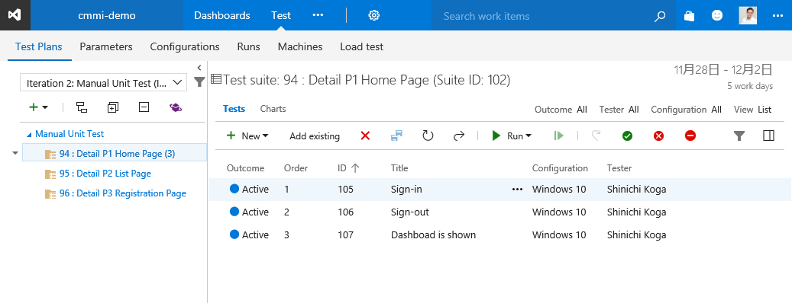
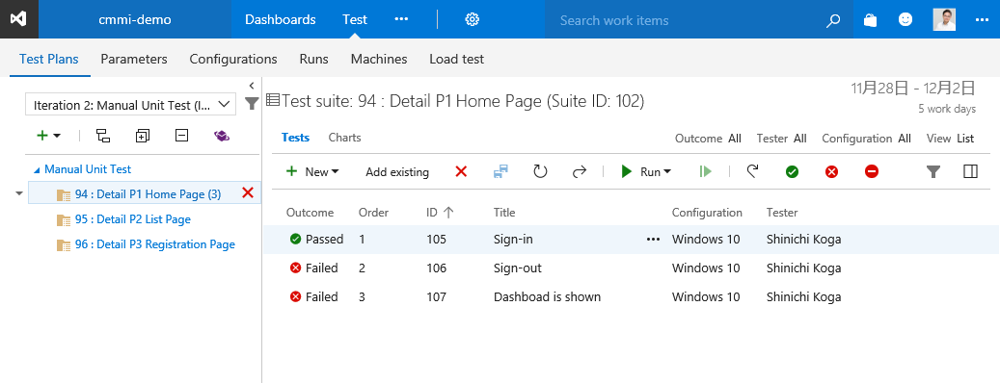
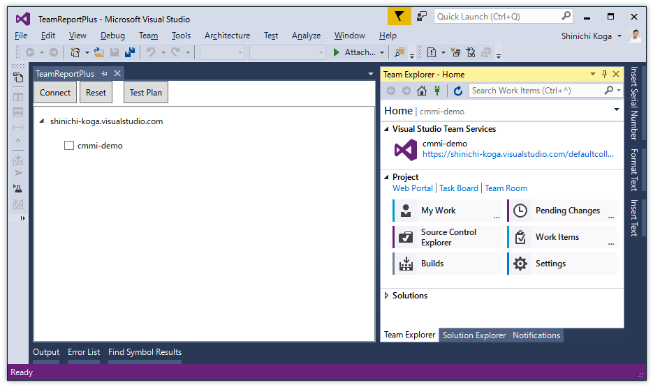
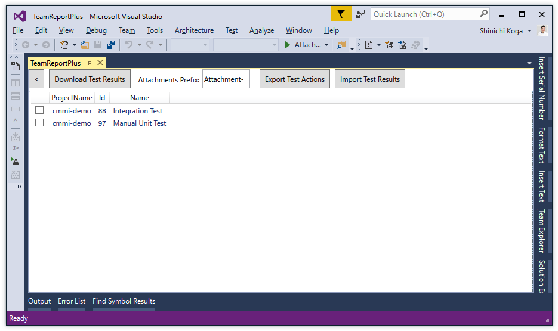
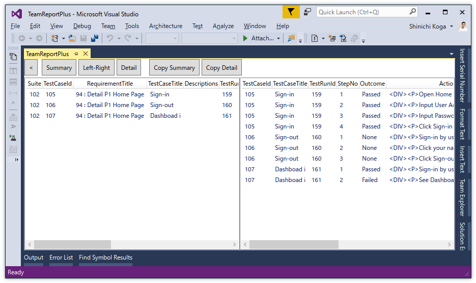
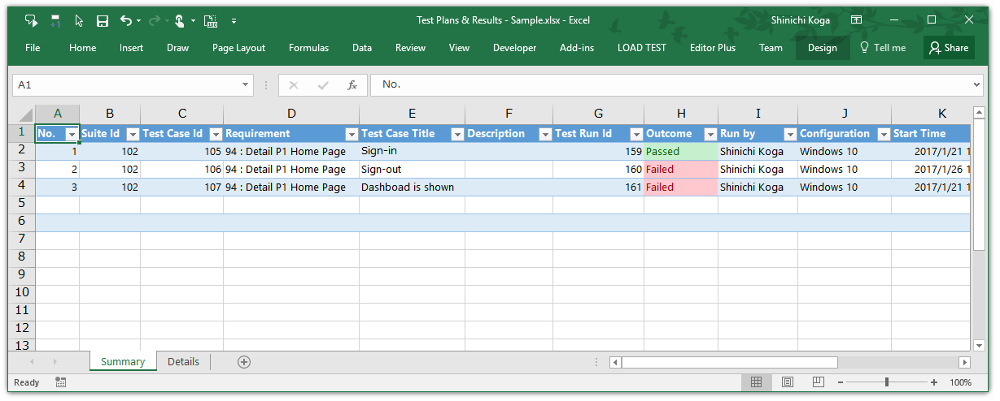
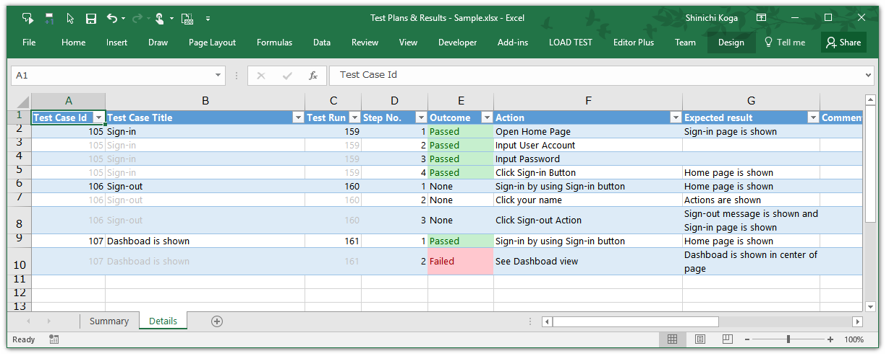
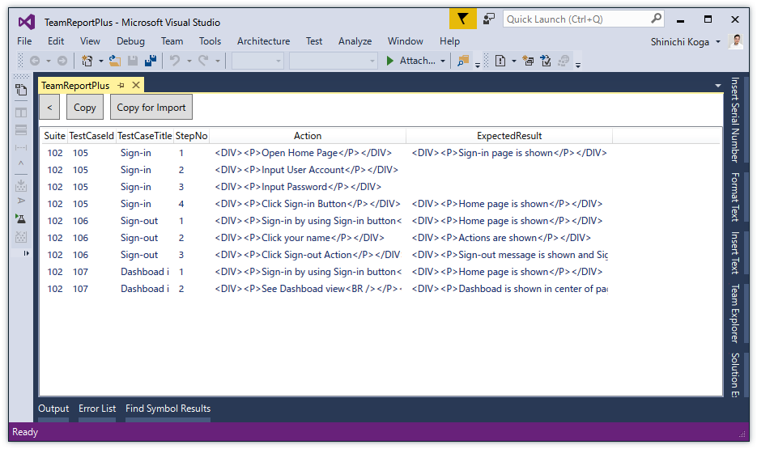
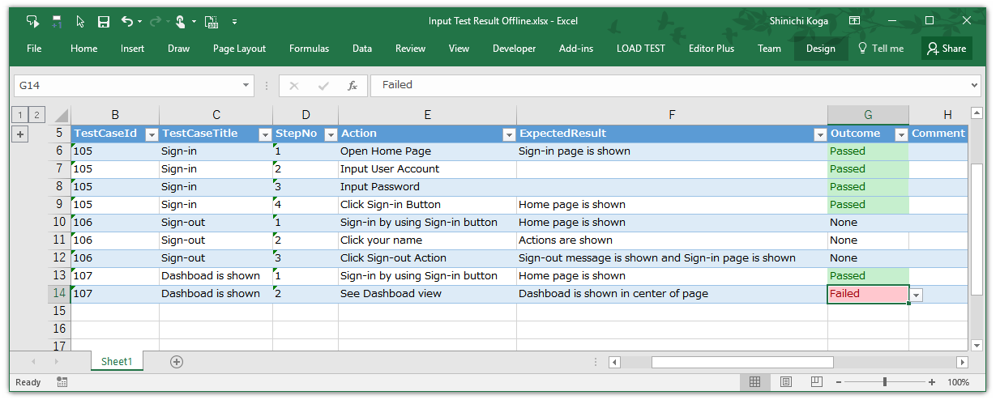
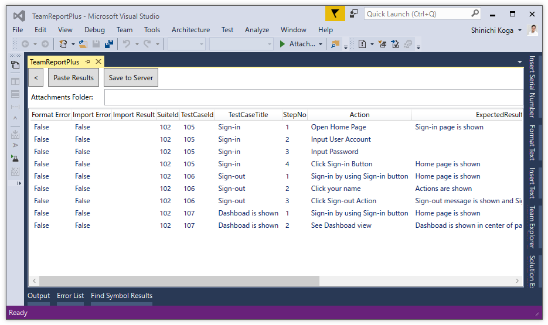

# How to use TeamReportPlus

## Installation
- Search and install in **Extensions and Update** of Visual Studio.
- Otherwise download from [Marketplace](https://marketplace.visualstudio.com/items?itemName=SHIN-ICHIKOGA.TeamReportPlus) and double click TeamReportPlus.vsix file.

## Features
### Download Test Results and Attachments
1. Open **Test** of Visual Studio Team Services (VSTS) or Team Foundation Server(TFS) . 
1. Add Test Suites, Test Plans, Test Cases, Test Actions and expected results.

1. Run Tests. Save results (Passed or Failed) and attachments of each steps.

1. Open Visual Studio.
1. Show TeamReportPlus window ( Click **VIEW > Other Windows > TeamReportPlus**  ).
1. For the first time, Connection window is shown. Otherwise click **Connect** button.
1. Sign in to VSTS or TFS.
1. Check Team Projects of tree view to download test results.

1. Click **Test Plan** button. Test Plans are  shown.
1. Check Test Plans to download.

1. Click **Download Test Results** button. 
1. Please wait. Test Results are shown.  Attachments are saved in desktop folder and **File Explorer** is shown. ( To cancel the download, go back to the previous page. )

1. Click **Copy Summary** button and **Copy Detaile** button. 
1. Paste the TSV text  to Notepad or Excel etc... 

 
Download ["Sample - Test Plans & Results.xlsx"](ExcelBooks/Sample%20-%20Test%20Plans%20&%20Results.xlsx).

### Export Test Plan (Test Steps, Actions, Expected result) for offline editing
1. Open **Test** of Visual Studio Team Services (VSTS) or Team Foundation Server(TFS) .
1. Add Test Suites, Test Plans, Test Cases, Test Actions and expected results.

1. Open Visual Studio.
1. Show TeamReportPlus window ( Click **VIEW > Other Windows > TeamReportPlus**  ).
1. For the first time, Connection window is shown. Otherwise click **Connect** button.
1. Sign in to VSTS or TFS.
1. Check Team Project of tree view to export test plan.

1. Click **Test Plan** button. Test Plans are  shown.
1. Check Test Plans to export.

1. Click **Export Test Actions** button. 
1. Please wait. Test Sutes, Test Cases, Test Actions and Expected Results are shown. 

1. Click **Copy for Import** button.
1. Paste the TSV text to Excel file.

Download ["Sample - Export, Offline Editing & Import.xlsx"](ExcelBooks/Sample%20-%20Export,%20Offline%20Editing%20&%20Import.xlsx).

### Import Test Results and Attachments 
1. Export Test Plan to Excel file.
1. Run Tests and input to this Excel file in offline PC. 
Save results (Passed or Failed) and attachments of each steps. 
You must input **DateStarted** and **DateCompleted** fields, like "2017/01/17 13:24:23.847".

1. Save attachments files in a single folder.
1. Open Visual Studio in online PC.
1. Show TeamReportPlus window ( Click **VIEW > Other Windows > TeamReportPlus**  ).
1. For the first time, Connection window is shown. Otherwise click **Connect** button.
1. Sign in to VSTS or TFS.
1. Check Team Project of tree view to import test results.

1. Click **Test Plan** button. Test Plans are  shown.
1. Check Test Plans to import.

1. Click **Import Test Results** button.
1. Copy rows of the Excel file.
1. Click **Paste Results** button. Test results are shown.

1. Input **Attachments Folder**  path.
1. Click **Save to Server** button. Test Results are imported and attachments files are uploaded.

