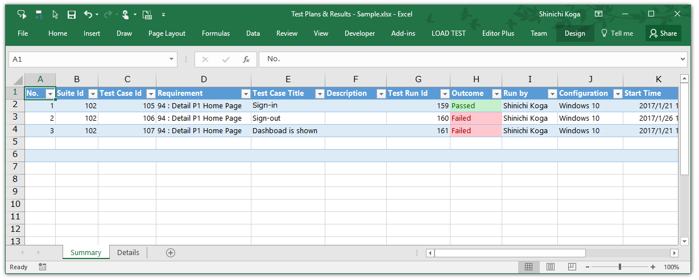

# TeamReportPlus
 Visual Studio extension to create test results reports as deliverables from Visual Studio Team Services.

## Background
Developers wants to use modern task management system and reporting, like Visual Studio Team Services(VSTS), Team Foundation Server(TFS) and Power BI. But traditional companies wants to use traditional documents, like Excel files. Use **TeamReportPlus** to download test results from VSTS/TFS. Developers can use TFS/VSTS usually and can create traditional documents quickly later.

## Features 
- Download test runs which includes step results and attachments from Visual Studio Team Services TEST. You can paste the TSV text to Excel file as deliverables. You can download all of attachments from some of Test Plan and some of Visual Studio Team Projects at once.
- Export Test Plan (Test Steps, Actions, Expected result) for offline editing.
- Import Test Results and attachments of each steps.

## Installation & How to use
See [HowToUse.md](HowToUse/HowToUse.md)

## Screen Captures

